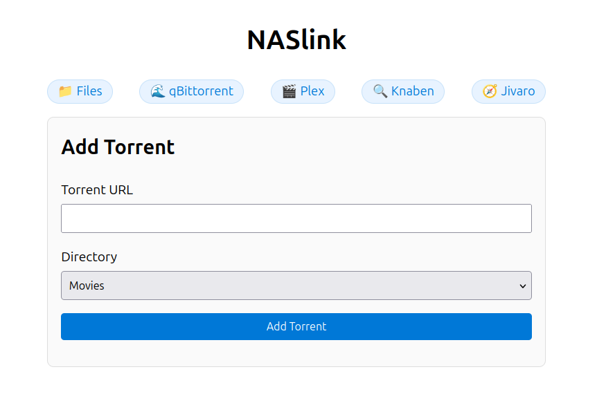

# NASLink

Lightweight web interface for easily adding torrents to a qBittorrent instance on a NAS device.

## Configuration

Configure using the following environment variables:
- `APP_PORT`: Port for the web interface (default: `3000`)
- `QBITTORRENT_HOST`: Host address of the qBittorrent instance (default: `0.0.0.0`)
- `QBITTORRENT_PORT`: Port of the qBittorrent instance (default: `8080`)
- `MOVIES_DIRECTORY`: Path to the movies directory (default: `/media/movies`)
- `SERIES_DIRECTORY`: Path to the series directory (default: `/media/series`)

## Publishing

Run the `publish.sh` script to build the project and prepare the `target/publish` directory for deployment.